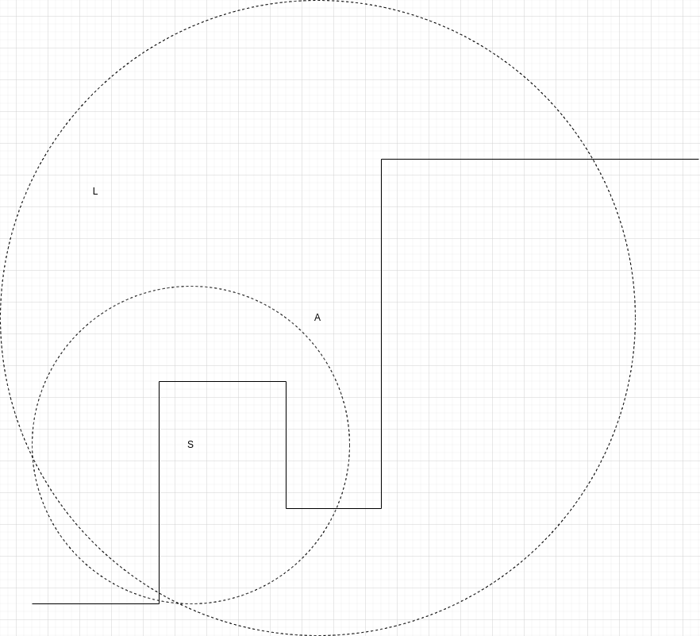

# Tyveangrep

Julenissens hjemmested på nordpolen har blitt kompromittert! Her snakker vi lokasjonen for lageret for ALLE gaver.
Bare for å få litt perspektiv på hva vi snakker om her, så er det 10 millioner kroner av verdi i kun gyngehester. Og folk flest får jo ikke gyngehest.
En hel haug av tyver er nå på vei til nordpolen for å stjele gaver.

For å forsvare seg har julenissen sett seg nødt til å sette opp en del forsvarsposter, slik at han kjøper seg nok tid til å frakte alle gaver i sikkerhet.
Sneglulfs slimkanoner, alvenes teleportlaser, og alf prøysen-kanoner.

Hvor lang tid har julenissen på seg?

## Oppgave

`Tyver (T)`: Tyver kommer på rekke og rad, og beveger seg 1 rute av gangen. Flere tyver kan befinne seg på samme rute.

`Punkter (x,y)`: Viser hvor løypa fra start til slutt går. Ruta mellom to punkter er alltid horisontal eller vertikal, så tyvene vil aldri gå på skrå.

`Forsvar (S), (L) eller (A)`: Forsvarsposter som skal hindre tyvene å komme fram. Rekkevidden til forsvarspostene måles i absolutt avstand [Euclidian distance](https://en.wikipedia.org/wiki/Euclidean_distance).  
Kanonene vil alltid prioritere fremste tyv, med mindre de allerede er påvirket av en effekt. Hvis fremste tyv er påvirket av sneglulfs slimkanon på et tidspunkt, så vil ikke tyven bli valgt av hverken slimkanoner, alf prøysen-kanoner, eller telerportlaseren.
Cooldown er tidsenheter mellom hver forsvarsaction. Med en cooldown på 1 vil den kunne avfyre annenhver tidsenhet.
<br /> 
<br /> 
`Sneglulfs slimkanon (S)`: Halverer hastigheten på tyven den treffer, så den kun beveger seg 1 rute annenhver tidsenhet de neste 6 tidsenhetene. Hvis en tyv f. eks blir skudd i t=5, så vil tyven stå i samme posisjon i t=6, begevege seg ett steg i t=7, og miste effekten i t=11. Så på t=11 vil den kunne skytes av en annen forsvarspost. Tyven beveger seg totalt 3 ruter de neste 6 tidsenhetene etter å ha blitt truffet av slimkanonen. Har en cooldown på 1, og rekkevidde 5 ruter.

`Alvenes teleportlaser (L)`: Teleporterer tyver bort fra nordpolen. Har en cooldown på 3, og uendelig rekkevidde. (Den vil kun nå tyver etter de har entret verden i punkt (0, 0)).

`Alf prøysen-kanon (A)`: Tyven blir midlertidig send inn i en bakvendt dimensjon. Og går feil retning de 2 neste tidsenhetene. Har en cooldown på 1, og rekkevidde 10 ruter. (Tyver vil ikke gå ut av verden baklengs. Hvis de f. eks. blir skutt i punk (0,0) så forblir de der de neste 2 tidsenhetene)
<br /> 
<br /> 
Inputen for spillet som ligger [her](input.txt), har 3 linjer med tekst.

1. Første linje beskriver en rekke med tyver. Denne skal leses inn fra venstre til høyre, så første tyv blir index 0. Bokstaven "T" representerer en tyv, og mellomrom representerer pause mellom tyvene. Alle starter utenfor brettet ved t=0, så første tyv havner på brettet i posisjon (0, 0) ved t=1.

2. Andre linje beskriver punktene på ruta fra start til slutt. Dette er kommaseparerte tupler, (x, y), fra første til siste punkt, som beskriver ruta tyvene må gå.

3. Tredje linje beskriver forsvarspostene. Disse er kommaseparerte 3-dimensjonelle punkter, som sier hvilken type S/L/A forsvaret er, og x og y posisjonen til forsvarsposten(se eksempel). Den forsvarsposten som ligger først i lista vil avfyres først, så hvis to forsvarsposter kan velge samme tyv, så vil den andre forsvarseposten måtte finne en annen tyv.

Hvor mange tidsenheter tar det før første tyv kommer til siste punkt i ruta, og ankommer julenissens hjemmested?

## Eksempel
Med input: 
```
T TT T   TT   TTTTT  TTTTTT TT TTTTT TTTT 
(0,0),(4,0),(4,7),(8,7),(8,3),(11,3),(11,14),(20,14)
(L,2,13),(S,5,5),(A,9,9)
```

Vil forsvaret se slik ut:
  
Her vil første tyv nå siste punkt i ruta etter 85 tidsenheter. Svaret blir da 85.

Med samme punkter og forsvar, men tyver:  
`TTT TT TTTT TTTTT TTTTTTT TTTT`
Så blir svaret 75.
